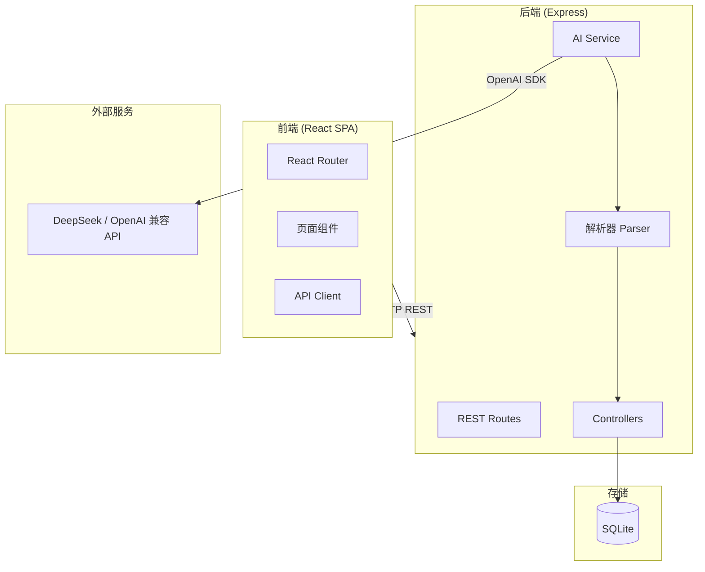
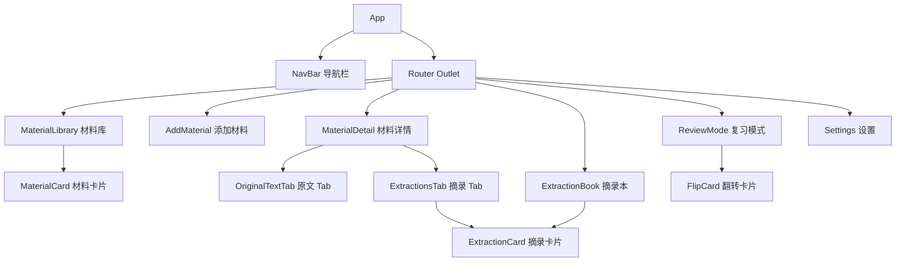
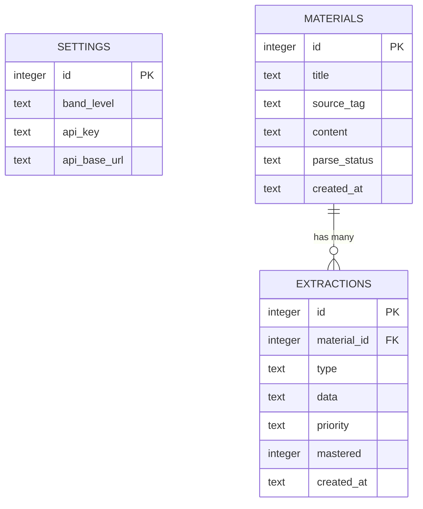
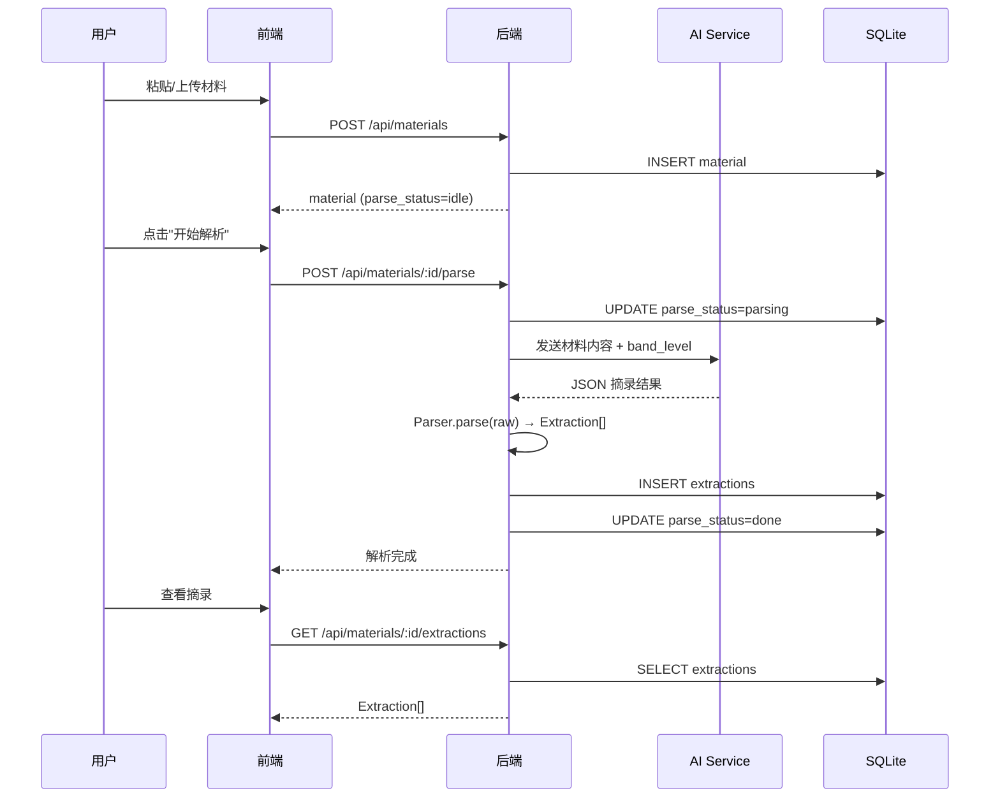

# 设计文档 — IELTS Material Reviewer

## 概述

IELTS Material Reviewer 是一个单用户雅思备考材料复习 Web 应用。用户导入英语学习材料（文章、播客文稿、Vlog 脚本等），系统通过 AI 自动提取生词、词组搭配和优质句子表达，并支持卡片式复习。

系统采用前后端分离架构：
- **前端**：React + TypeScript + Tailwind CSS 单页应用，通过 React Router 实现客户端路由
- **后端**：Node.js (Express) REST API + SQLite 持久化存储
- **AI 集成**：通过 OpenAI SDK 的 `baseURL` 参数对接 DeepSeek 或其他兼容服务

设计风格遵循 editorial financial light 主题：Playfair Display 衬线标题、IBM Plex Mono 等宽 UI 标签、Geist 正文、暖色羊皮纸底色 `#F4F2EF`、海军蓝 `#384F84` 和金色 `#C8B496` 点缀、1px 细线网格、零圆角零阴影。

## 架构

### 系统架构图



### 前端路由结构

| 路径 | 页面 | 说明 |
|------|------|------|
| `/` | MaterialLibrary | 材料库首页，卡片网格 |
| `/materials/new` | AddMaterial | 添加材料页 |
| `/materials/:id` | MaterialDetail | 材料详情页（原文/摘录双 Tab） |
| `/extractions` | ExtractionBook | 摘录本，跨材料列表 |
| `/review` | ReviewMode | 卡片式复习模式 |
| `/settings` | Settings | 英语水平 + AI 配置 |

### 后端 API 结构

所有 API 以 `/api` 为前缀，返回 JSON。

| 方法 | 路径 | 说明 |
|------|------|------|
| `GET` | `/api/materials` | 获取材料列表（按时间倒序） |
| `POST` | `/api/materials` | 创建新材料 |
| `GET` | `/api/materials/:id` | 获取材料详情（含原文） |
| `DELETE` | `/api/materials/:id` | 删除材料及其摘录 |
| `POST` | `/api/materials/:id/parse` | 触发 AI 解析 |
| `GET` | `/api/materials/:id/extractions` | 获取指定材料的摘录 |
| `GET` | `/api/extractions` | 获取所有摘录（支持筛选） |
| `PATCH` | `/api/extractions/:id/mastery` | 更新摘录掌握状态 |
| `GET` | `/api/extractions/review` | 获取复习卡片集（支持范围和类型筛选） |
| `GET` | `/api/settings` | 获取用户设置 |
| `PUT` | `/api/settings` | 更新用户设置 |


## 组件与接口

### 前端组件层次



### 前端关键接口

```typescript
// API Client — 封装所有后端请求
interface ApiClient {
  getMaterials(): Promise<Material[]>;
  createMaterial(data: CreateMaterialInput): Promise<Material>;
  getMaterial(id: number): Promise<MaterialDetail>;
  deleteMaterial(id: number): Promise<void>;
  parseMaterial(id: number): Promise<void>;
  getMaterialExtractions(id: number, filter?: ExtractionFilter): Promise<Extraction[]>;
  getExtractions(filter?: ExtractionFilter): Promise<Extraction[]>;
  updateMastery(id: number, mastered: boolean): Promise<Extraction>;
  getReviewCards(params: ReviewParams): Promise<Extraction[]>;
  getSettings(): Promise<UserSettings>;
  updateSettings(data: UserSettings): Promise<UserSettings>;
}

interface CreateMaterialInput {
  title: string;
  sourceTag: SourceTag;
  content: string;
}

interface ExtractionFilter {
  type?: ExtractionType;
  mastery?: MasteryStatus;
  sourceTag?: SourceTag;
}

interface ReviewParams {
  materialId?: number;   // 不传则全部
  type?: ExtractionType; // 不传则全部类型
}
```

### 后端关键模块

```typescript
// AI Service — 调用 OpenAI 兼容 API
class AIService {
  constructor(apiKey: string, baseURL: string);
  parseContent(content: string, bandLevel: BandLevel): Promise<RawAIResponse>;
}

// Parser — 解析 AI 返回结果
class Parser {
  static parse(raw: string): Extraction[];
  static format(extractions: Extraction[]): string;
}

// MaterialController
class MaterialController {
  list(req, res): Promise<void>;
  create(req, res): Promise<void>;
  getById(req, res): Promise<void>;
  delete(req, res): Promise<void>;
  parse(req, res): Promise<void>;
}

// ExtractionController
class ExtractionController {
  list(req, res): Promise<void>;
  listByMaterial(req, res): Promise<void>;
  updateMastery(req, res): Promise<void>;
  getReviewCards(req, res): Promise<void>;
}

// SettingsController
class SettingsController {
  get(req, res): Promise<void>;
  update(req, res): Promise<void>;
}
```

### AI Prompt 设计

AI 解析请求将构造如下 system prompt：

```
你是一个雅思备考助手。请分析以下英语材料，提取：
1. 词汇（vocabulary）：生词或雅思高频词汇
2. 词组（collocation）：值得学习的词组搭配
3. 句子（sentence）：值得学习的句子表达

用户当前英语水平为 Band {level}，请过滤掉低于该水平的基础内容。
根据雅思考试重点为每个摘录标注优先级（high/medium/low）。

请严格按以下 JSON 格式返回：
{
  "extractions": [
    {
      "type": "vocabulary",
      "word": "...",
      "definition": "...",
      "partOfSpeech": "...",
      "example": "...",
      "priority": "high|medium|low"
    },
    {
      "type": "collocation",
      "phrase": "...",
      "definition": "...",
      "example": "...",
      "priority": "high|medium|low"
    },
    {
      "type": "sentence",
      "sentence": "...",
      "analysis": "...",
      "scenario": "...",
      "priority": "high|medium|low"
    }
  ]
}
```


## 数据模型

### ER 图



### 表结构

#### settings 表

| 字段 | 类型 | 说明 |
|------|------|------|
| `id` | INTEGER PK | 固定为 1（单用户） |
| `band_level` | TEXT | 英语水平，默认 `"6.0"` |
| `api_key` | TEXT | AI API Key |
| `api_base_url` | TEXT | API Base URL，默认 `"https://api.deepseek.com"` |

#### materials 表

| 字段 | 类型 | 说明 |
|------|------|------|
| `id` | INTEGER PK | 自增主键 |
| `title` | TEXT NOT NULL | 材料标题 |
| `source_tag` | TEXT NOT NULL | 来源标签：`vlog` / `article` / `podcast` / `other` |
| `content` | TEXT NOT NULL | 材料原文 |
| `parse_status` | TEXT | 解析状态：`idle` / `parsing` / `done` / `error` |
| `created_at` | TEXT | ISO 8601 时间戳 |

#### extractions 表

| 字段 | 类型 | 说明 |
|------|------|------|
| `id` | INTEGER PK | 自增主键 |
| `material_id` | INTEGER FK | 关联材料 ID |
| `type` | TEXT NOT NULL | 摘录类型：`vocabulary` / `collocation` / `sentence` |
| `data` | TEXT NOT NULL | JSON 字符串，存储该类型摘录的具体字段 |
| `priority` | TEXT | 优先级：`high` / `medium` / `low` |
| `mastered` | INTEGER | 掌握状态：`0`=未掌握，`1`=已掌握，默认 `0` |
| `created_at` | TEXT | ISO 8601 时间戳 |

### TypeScript 类型定义

```typescript
type SourceTag = 'vlog' | 'article' | 'podcast' | 'other';
type ExtractionType = 'vocabulary' | 'collocation' | 'sentence';
type BandLevel = '5.0' | '5.5' | '6.0' | '6.5' | '7+';
type Priority = 'high' | 'medium' | 'low';
type MasteryStatus = 'unmastered' | 'mastered';
type ParseStatus = 'idle' | 'parsing' | 'done' | 'error';

interface Material {
  id: number;
  title: string;
  sourceTag: SourceTag;
  content: string;
  parseStatus: ParseStatus;
  createdAt: string;
  extractionCount?: number; // 列表视图附带
}

interface VocabularyData {
  word: string;
  definition: string;
  partOfSpeech: string;
  example: string;
}

interface CollocationData {
  phrase: string;
  definition: string;
  example: string;
}

interface SentenceData {
  sentence: string;
  analysis: string;
  scenario: string;
}

type ExtractionData = VocabularyData | CollocationData | SentenceData;

interface Extraction {
  id: number;
  materialId: number;
  type: ExtractionType;
  data: ExtractionData;
  priority: Priority;
  mastered: boolean;
  createdAt: string;
  materialTitle?: string; // 摘录本视图附带
}

interface UserSettings {
  bandLevel: BandLevel;
  apiKey: string;
  apiBaseUrl: string;
}
```

### 数据流




## 正确性属性（Correctness Properties）

*属性（Property）是指在系统所有有效执行中都应成立的特征或行为——本质上是对系统应做什么的形式化陈述。属性是人类可读规格说明与机器可验证正确性保证之间的桥梁。*

### Property 1: 材料持久化往返

*For any* 有效的材料输入（非空标题、有效来源标签、非空内容），创建材料后再通过 ID 查询，返回的标题、来源标签和内容应与输入完全一致。

**Validates: Requirements 1.6**

### Property 2: 材料输入验证拒绝无效数据

*For any* 标题为纯空白字符串或内容为纯空白字符串的材料提交请求，系统应拒绝该请求并返回验证错误，数据库中的材料数量不应增加。

**Validates: Requirements 1.7**

### Property 3: 文件格式验证

*For any* 文件扩展名不是 `.txt` 或 `.md` 的上传文件，系统应拒绝该文件。*For any* 扩展名为 `.txt` 或 `.md` 的文件，系统应接受该文件。

**Validates: Requirements 1.3**

### Property 4: 解析器往返一致性

*For any* 有效的摘录对象数组，执行 `Parser.parse(Parser.format(extractions))` 应产生与原始数组等价的摘录对象数组。

**Validates: Requirements 2.10, 2.11, 2.12**

### Property 5: 摘录类型字段完整性

*For any* 有效的 AI 响应 JSON，解析后的每个词汇摘录应包含 word、definition、partOfSpeech、example 字段；每个词组摘录应包含 phrase、definition、example 字段；每个句子摘录应包含 sentence、analysis、scenario 字段。

**Validates: Requirements 2.2, 2.3, 2.4**

### Property 6: 无效 AI 响应错误处理

*For any* 非法 JSON 字符串或缺少必需字段的 JSON 对象，`Parser.parse()` 应抛出错误而不是返回不完整的数据。

**Validates: Requirements 2.9**

### Property 7: 掌握状态往返

*For any* 摘录，将其标记为"已掌握"后再"取消掌握"，其掌握状态应恢复为"未掌握"，与初始状态一致。

**Validates: Requirements 3.3, 3.4**

### Property 8: 摘录筛选正确性

*For any* 摘录列表和任意筛选条件组合（类型、掌握状态、来源标签），筛选结果中的每一条摘录都应满足所有指定的筛选条件，且原列表中满足条件的摘录不应被遗漏。

**Validates: Requirements 3.2, 3.6**

### Property 9: 复习集只含未掌握摘录

*For any* 复习范围和类型参数，返回的复习卡片集中的每一条摘录的掌握状态都应为"未掌握"。

**Validates: Requirements 4.2**

### Property 10: 复习总结数据一致性

*For any* 复习会话，复习完成时的总结信息中"复习总数"应等于初始卡片集大小，"本次标记已掌握数量"应等于用户在本次会话中点击"已掌握"的次数。

**Validates: Requirements 4.5, 4.7**

### Property 11: 材料列表时间倒序

*For any* 材料列表查询结果，列表中相邻两个材料的创建时间应满足前者 >= 后者（即按时间降序排列）。

**Validates: Requirements 5.2**

### Property 12: 原文高亮覆盖已提取词汇和词组

*For any* 材料及其关联的词汇和词组摘录，高亮函数处理原文后，每个已提取的词汇单词和词组文本在结果中都应被标记为高亮。

**Validates: Requirements 5.5**

### Property 13: 设置持久化往返

*For any* 有效的用户设置（band_level 取值范围内、非空 api_key、有效 URL 格式的 api_base_url），保存设置后再读取应得到与输入完全一致的值。

**Validates: Requirements 6.2, 6.5**

### Property 14: 导航高亮与路由一致

*For any* 应用中的有效路由路径，导航栏中与该路径对应的入口应处于高亮状态，其余入口不应高亮。

**Validates: Requirements 8.3**


## 错误处理

### 前端错误处理

| 场景 | 处理方式 |
|------|----------|
| 表单验证失败（空标题/空内容） | 在对应输入框下方显示红色错误提示文本，阻止提交 |
| 文件格式不支持 | 显示 toast 提示"仅支持 .txt 和 .md 格式的文件" |
| API 请求失败（网络错误） | 显示 toast 提示"网络连接失败，请检查网络后重试" |
| API 请求失败（服务端错误） | 显示 toast 提示具体错误信息 |
| AI 解析失败 | 在材料详情页显示错误状态，提供"重新解析"按钮 |
| 未配置 API Key 时触发解析 | 显示提示"请先在设置中配置 AI API Key"，附带跳转设置页的链接 |

### 后端错误处理

| 场景 | HTTP 状态码 | 响应格式 |
|------|------------|----------|
| 请求参数验证失败 | 400 | `{ "error": "具体错误描述" }` |
| 材料/摘录不存在 | 404 | `{ "error": "资源不存在" }` |
| AI API Key 未配置 | 422 | `{ "error": "请先在设置中配置 AI API Key" }` |
| AI 服务调用失败 | 502 | `{ "error": "AI 服务调用失败: 具体原因" }` |
| AI 返回数据解析失败 | 502 | `{ "error": "AI 返回数据格式异常" }` |
| 服务器内部错误 | 500 | `{ "error": "服务器内部错误" }` |

### AI 服务容错

- AI 调用设置 30 秒超时
- 解析失败时将材料的 `parse_status` 设为 `error`，不写入任何摘录
- 用户可随时重新触发解析，重新解析前清除该材料的旧摘录数据

## 测试策略

### 测试框架选型

- **单元测试 & 属性测试**：Vitest + fast-check
- **前端组件测试**：React Testing Library
- **API 集成测试**：Supertest

### 属性测试（Property-Based Testing）

使用 `fast-check` 库实现属性测试，每个属性测试至少运行 100 次迭代。每个测试用注释标注对应的设计属性。

标注格式：`Feature: ielts-material-reviewer, Property {number}: {property_text}`

属性测试覆盖范围：

| 属性 | 测试目标 | 生成器 |
|------|----------|--------|
| P1 材料持久化往返 | 创建→查询往返 | 随机标题、来源标签、内容 |
| P2 输入验证拒绝 | 空白输入拒绝 | 纯空白字符串生成器 |
| P3 文件格式验证 | 扩展名校验 | 随机文件名 + 扩展名 |
| P4 解析器往返 | parse(format(x)) === x | 随机摘录对象数组 |
| P5 字段完整性 | 解析后字段检查 | 随机有效 AI 响应 JSON |
| P6 无效响应错误 | 异常 JSON 处理 | 随机无效 JSON 字符串 |
| P7 掌握状态往返 | 标记→取消往返 | 随机摘录 ID |
| P8 筛选正确性 | 筛选结果验证 | 随机摘录列表 + 随机筛选条件 |
| P9 复习集过滤 | 只含未掌握 | 随机摘录列表（混合掌握状态） |
| P10 复习总结一致 | 总结数据验证 | 随机复习会话 |
| P11 时间倒序 | 排序验证 | 随机时间戳材料列表 |
| P12 高亮覆盖 | 高亮函数验证 | 随机原文 + 随机词汇/词组 |
| P13 设置往返 | 保存→读取往返 | 随机设置值 |
| P14 导航高亮 | 路由→高亮映射 | 所有有效路由路径 |

### 单元测试

单元测试聚焦于具体示例、边界情况和集成点：

- **Parser 模块**：测试具体的 AI 响应示例、畸形 JSON、缺失字段、空数组等边界情况
- **输入验证**：测试空字符串、纯空格、特殊字符等具体输入
- **API 路由**：使用 Supertest 测试各端点的请求/响应格式
- **组件渲染**：使用 React Testing Library 测试各摘录类型卡片的渲染输出
- **高亮函数**：测试具体的原文 + 摘录组合的高亮结果
- **设置默认值**：验证 API Base URL 默认为 DeepSeek 地址

### 测试组织

```
tests/
├── unit/
│   ├── parser.test.ts          # 解析器单元测试
│   ├── validation.test.ts      # 输入验证单元测试
│   └── highlight.test.ts       # 高亮函数单元测试
├── property/
│   ├── parser.property.test.ts       # P4, P5, P6
│   ├── material.property.test.ts     # P1, P2, P3, P11
│   ├── extraction.property.test.ts   # P7, P8, P9, P10
│   ├── settings.property.test.ts     # P13
│   └── ui.property.test.ts           # P12, P14
├── integration/
│   ├── materials.api.test.ts   # 材料 API 集成测试
│   ├── extractions.api.test.ts # 摘录 API 集成测试
│   └── settings.api.test.ts    # 设置 API 集成测试
└── components/
    ├── MaterialCard.test.tsx    # 材料卡片组件测试
    ├── ExtractionCard.test.tsx  # 摘录卡片组件测试
    └── FlipCard.test.tsx        # 翻转卡片组件测试
```

每个属性测试必须由单个属性测试实现，使用 `fc.assert(fc.property(...))` 模式，最少 100 次迭代。
